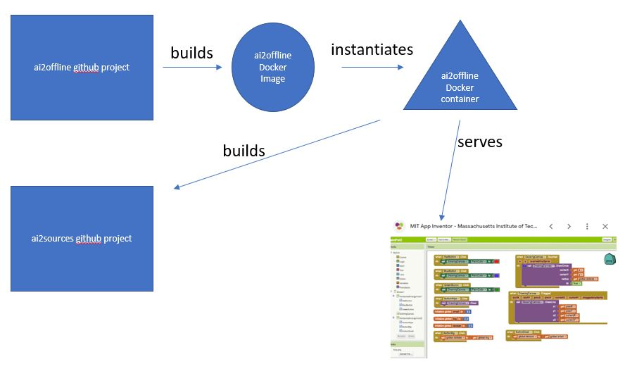

# ai2offline
Develop MIT AI2 Apps Offline on Windows Using Docker Container

Requirements:
- Windows
- Docker installed
- Git installed
- Internet access (to initially download dependencies)
- Some basic background knowledge of MIT AI2
- To run MIT AI2 with the emulator, you'll need to have the AI2 emulator (aka AIStarter) installed

References:
- https://github.com/mit-cml/appinventor-sources
- REM https://github.com/himgodfreyho/appinventor-docker

1.  (Optional but recommended) Download and install the MIT AI2 Starter program to your Windows box.  This will give you access to the "emulator" that you may want to use as you develop AI2 apps.
1.  Download this github project from github
2.  Change to the project's root (ai2offline) directory
3.  Edit the file `2_compile.bat` file and replace the environment variable `AI2_SOURCE_DIR` with the parent path to the ai2offline root's directory and a suffix of "appinventor-sources", e.g. set the variable to: `C:\Users\myUserName\gitprojects\appinventor-sources` if your ai2offline root is at `C:\Users\myUserName\gitprojects\ai2offline`.
4.  Create the ai2offline image and compile the AI2 source code by running the batch files in this order:
    * `0_download_ai2_source.bat` (this will download the AI2 source files)
    * `1_dbuildimage.bat` (this will build the ai2offline docker image)
    * `2_dcompile.bat` (this will compile the AI2 source files using the ai2offline docker container)
5. When you are ready to play with the AI2 development, first start up the AI2 companion server using the ai2offline docker container:
    * 3_run_ai_server.bat
6. Then point your browser at: `localhost:8888`

